# Task Management Application

A production-quality full-stack task management application demonstrating clean architecture, microservices integration, and AI capabilities.

## 🌐 Live Demo

**Production URLs:**

- **Frontend:** [https://task-management-app-eight-chi.vercel.app/](https://task-management-app-eight-chi.vercel.app/)
- **Backend API:** [https://task-management-app-qggg.onrender.com](https://task-management-app-qggg.onrender.com)

## ⏱️ Time Log (Effort Distribution – Approximate)

| Area | Time Spent | Percentage |
| --- | ---: | ---: |
| UI & Responsiveness | ~3 hours | 27% |
| Backend APIs & Database | ~3 hours | 27% |
| AWS Lambda Authentication | ~2 hours | 18% |
| AI Task Title Suggestion | ~1 hour | 9% |
| Debugging, Testing & Deployment | ~2 hours | 18% |

Note: Time values are approximate. Percentages are computed relative to the total reported time (~11 hours).

## Overview

This application provides a comprehensive task management system with:

- Full CRUD operations for tasks
- Status-based workflow management
- Priority and status filtering
- AI-powered task title suggestions
- AWS Lambda-based authentication microservice
- Activity logging for task operations

```mermaid
flowchart LR
    U[👤 User]:::user --> A[🌐 React App]:::app
    A -->|POST /login| G[🚪 API Gateway]:::gateway
    G -->|Invoke| L[⚡ AWS Lambda]:::lambda
    L -->|Mock Token| G
    G -->|Store Token in 
         Local Storage| A

    classDef user fill:#E0F2FE,stroke:#0284C7,stroke-width:2px
    classDef app fill:#ECFEFF,stroke:#0891B2,stroke-width:2px
    classDef gateway fill:#FFF7ED,stroke:#EA580C,stroke-width:2px
    classDef lambda fill:#FEF3C7,stroke:#D97706,stroke-width:2px

```



## Tech Stack

### Frontend

- **React 18** with Vite
- **Axios** for API communication
- **CSS3** + utility-first classes (Tailwind-inspired approach, no UI frameworks)

### Backend

- **Node.js** with Express
- **MongoDB** with Mongoose
- **RESTful API** architecture

### Cloud Services

- **AWS Lambda** for authentication microservice
- **API Gateway** for Lambda endpoint exposure

### AI Integration

- **OpenAI GPT-3.5-turbo** (with fallback to mock responses)

## Project Structure

```
TaskManagement/
├── client/
│   └── src/
│       ├── components/      # Reusable UI components
│       ├── pages/           # Page-level components
│       ├── services/        # API and external service integrations
│       └── utils/           # Utility functions
├── server/
│   ├── config/             # Database and configuration
│   ├── controllers/        # Request handlers
│   ├── models/             # Mongoose schemas
│   └── routes/             # Express route definitions
└── lambda/
    └── login/              # AWS Lambda authentication function
```

## Setup Instructions

### Prerequisites

- Node.js 18+ and npm
- MongoDB (local or cloud instance)
- AWS Account (for Lambda deployment, optional for local testing)

### Backend Setup

1. Navigate to the server directory:

   ```bash
   cd server
   ```

2. Install dependencies:

   ```bash
   npm install
   ```

3. Create a `.env` file:

   ```bash
   cp .env.example .env
   ```

4. Update `.env` with your MongoDB connection string:

   ```
   PORT=5000
   MONGODB_URI=mongodb+srv://<username>:<password>@cluster.mongodb.net/TaskMangment
   ```

   > **Note:** In production, the backend is connected to **MongoDB Atlas**.  
   > Local MongoDB is used only for development.

5. Start the server:
   ```bash
   npm start
   # or for development with auto-reload
   npm run dev
   ```

The server will run on `http://localhost:5000`

### Frontend Setup

1. Navigate to the client directory:

   ```bash
   cd client
   ```

2. Install dependencies:

   ```bash
   npm install
   ```

3. Create a `.env` file (optional):

   ```bash
   cp .env.example .env
   ```

   For local development, you can leave `VITE_API_BASE_URL` empty (defaults to `http://localhost:5000`).

   For production, set:

   ```
   VITE_API_BASE_URL=https://task-management-app-qggg.onrender.com
   VITE_LAMBDA_ENDPOINT=https://your-api-gateway-url.execute-api.region.amazonaws.com/prod/login
   VITE_OPENAI_API_KEY=your-openai-api-key
   ```

4. Start the development server:
   ```bash
   npm run dev
   ```

The frontend will run on `http://localhost:3000`

**Note:** The frontend uses a central API configuration (`client/src/config/api.js`) that reads from `VITE_API_BASE_URL`. If not set, it defaults to `http://localhost:5000` in development mode.

### AWS Lambda Deployment

1. Navigate to the lambda directory:

   ```bash
   cd lambda/login
   ```

2. Create a deployment package:

   ```bash
   zip -r login-function.zip index.js package.json
   ```

3. In AWS Console:

   - Create a new Lambda function (Node.js 18.x runtime)
   - Upload `login-function.zip`
   - Set handler to `index.handler`
   - Create an API Gateway trigger
   - Enable CORS
   - Deploy the API

4. Update frontend `.env` with the API Gateway endpoint URL

**Note:** For local testing without AWS, the frontend will show an error but you can still test the application by modifying the auth service to use a mock endpoint.

## Key Design Decisions

### Architecture

1. **Separation of Concerns**

   - Frontend, backend, and Lambda are completely independent
   - Clear service layer abstraction for API calls
   - Controllers handle business logic, models handle data structure

2. **Status Progression Enforcement**

   - Implemented as a state machine: `Pending → In Progress → Completed`
   - Backend validates transitions to prevent invalid state changes
   - Frontend only shows valid next actions

3. **Microservices Pattern**

   - Authentication isolated in AWS Lambda
   - Demonstrates real-world microservices architecture
   - Frontend calls Lambda directly (no backend proxy)

4. **AI Integration Abstraction**
   - Service layer handles both real and mock AI responses
   - Graceful fallback to mock when API key is unavailable
   - Clean error handling and user feedback

### Data Model

- **Tasks**: Core entity with all required fields
- **Activity Logs**: Separate collection for audit trail
- **Timestamps**: Automatic createdAt/updatedAt via Mongoose

### Error Handling

- Consistent error response format
- Frontend displays user-friendly error messages
- Backend validates data and business rules
- Status transition errors provide clear feedback

## API Endpoints

### Tasks

- `POST /api/tasks` - Create a new task
- `GET /api/tasks` - Get all tasks (supports `?status=` and `?priority=` filters)
- `GET /api/tasks/:id` - Get a single task
- `PUT /api/tasks/:id` - Update a task
- `DELETE /api/tasks/:id` - Delete a task

### Activity Logs

- `GET /api/tasks/logs/activity` - Get activity logs (supports `?taskId=` filter)

## Features

### Task Management

- ✅ Create, read, update, delete tasks
- ✅ Filter by status and priority
- ✅ Enforced status progression workflow
- ✅ Delete confirmation modal
- ✅ Past due date indicators

### AI Integration

- ✅ Task title suggestion based on description
- ✅ Fallback to mock responses when API unavailable
- ✅ Clean service abstraction

### Authentication

- ✅ AWS Lambda microservice
- ✅ Token-based authentication
- ✅ Mock users for testing

### Activity Logging

- ✅ Tracks all task operations
- ✅ Records status changes with old/new values
- ✅ Queryable by task ID

## Challenges Faced

1. **Status Transition Validation**

   - Solution: Implemented state machine pattern in backend controller
   - Clear error messages guide users to valid transitions

2. **Lambda CORS Configuration**

   - Solution: Added proper CORS headers in Lambda response
   - Handles OPTIONS preflight requests

3. **AI Service Reliability**

   - Solution: Implemented graceful fallback to mock responses
   - Service abstraction allows easy switching between real and mock

4. **Form State Management**
   - Solution: Controlled components with React state
   - Clear separation between create and edit modes

## Future Improvements

### Short-term

1. **User Management**

   - Multi-user support with user-specific task lists
   - Role-based access control

2. **Enhanced Filtering**

   - Date range filters
   - Category-based filtering
   - Search functionality

3. **UI/UX Enhancements**
   - Drag-and-drop for status changes
   - Keyboard shortcuts
   - Dark mode

### Medium-term

1. **Real-time Updates**

   - WebSocket integration for live task updates
   - Collaborative editing

2. **Advanced AI Features**

   - Task prioritization suggestions
   - Deadline recommendations
   - Task categorization

3. **Performance Optimization**
   - Task pagination
   - Virtual scrolling for large lists
   - Caching strategies

### Long-term

1. **Mobile Application**

   - React Native version
   - Offline support

2. **Analytics Dashboard**

   - Task completion metrics
   - Productivity insights
   - Time tracking

3. **Integration Capabilities**
   - Calendar integration
   - Email notifications
   - Third-party tool connectors

## Testing

### Manual Testing Checklist

- [x] Create task with all fields
- [x] Filter tasks by status and priority
- [x] Update task fields
- [x] Change task status (valid transitions only)
- [x] Attempt invalid status transition (should fail)
- [x] Delete task (with confirmation)
- [x] Generate AI task title suggestion
- [x] Login via Lambda endpoint
- [x] View activity logs

## Production Considerations

1. **Security**

   - Implement proper JWT validation
   - Add rate limiting
   - Sanitize user inputs
   - Use environment variables for secrets

2. **Performance**

   - Add database indexes
   - Implement caching layer
   - Optimize API responses

3. **Monitoring**

   - Add logging service (e.g., Winston)
   - Error tracking (e.g., Sentry)
   - Performance monitoring

4. **Scalability**
   - Consider database sharding
   - Implement load balancing
   - Use CDN for static assets

## License

This project is for demonstration purposes.

## Contact

For questions or feedback, please refer to the codebase structure and inline comments for implementation details.
